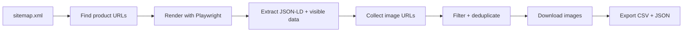

# Sitemap Product Image Scraper

[](https://www.python.org/)
[](https://playwright.dev/python/)
[](LICENSE)

**Python CLI tool for extracting ecommerce product data and images from sitemap-listed product pages into organised folders, CSV, and JSON.**

Hi, I’m Ming Tan. I built this as a practical Python CLI for turning ecommerce sitemap product pages into structured product data and organised image folders. It is designed for legitimate ecommerce migration, SEO audit, product-data review, and asset inventory workflows where a sitemap is the cleanest starting point.

## What It Does

Sitemap Product Image Scraper reads a `sitemap.xml` URL, finds product pages that match a URL filter such as `/product/`, renders each page with Playwright, extracts product information, downloads product images, and exports the results into clean local files.

The scraper prefers JSON-LD Product schema when a page provides it, then falls back to visible HTML, Open Graph metadata, Twitter image metadata, and common ecommerce selectors.

## Who It Is For

- Ecommerce developers
- Shopify and WooCommerce builders
- SEO specialists auditing ecommerce sites
- Data analysts creating product datasets
- Website migration teams
- Store owners who own or have permission to process product data
- Developers learning ethical web scraping and product-data extraction

## Key Features

- Reads sitemap files and sitemap indexes
- Filters product URLs by substring or regex-style pattern
- Renders JavaScript-powered pages with Playwright
- Extracts product name, price, currency, SKU, availability, and description
- Uses JSON-LD Product data first where available
- Falls back to visible product content where needed
- Extracts image URLs from `img`, `currentSrc`, `srcset`, `data-src`, `data-image`, Open Graph, and Twitter metadata
- Skips likely icons, logos, favicons, SVGs, sprites, placeholders, base64 images, and tracking pixels
- Deduplicates image URLs and downloaded image files with SHA-256 hashes
- Saves product images into product-specific folders
- Exports `products.csv` and `products.json`
- Continues after individual page failures and stores the error in the output record

## Example Use Cases

- Build a product image inventory before a Shopify or WooCommerce migration
- Audit product pages for missing structured data, SKU, price, or image fields
- Create a local product dataset from your own ecommerce website
- Review product images and metadata during a site rebuild
- Prepare raw product data for later PIM, DAM, Shopify, WooCommerce, or analytics workflows

## How It Works



## Quick Start

```bash
git clone https://github.com/YOUR-USERNAME/sitemap-product-image-scraper.git
cd sitemap-product-image-scraper

python3.11 -m venv venv
source venv/bin/activate

pip install -r requirements.txt
playwright install chromium

python scrape_sitemap_products.py \
  --sitemap "https://example.com/sitemap.xml" \
  --max-products 10
```

On Windows PowerShell, activate the virtual environment with:

```powershell
.\venv\Scripts\Activate.ps1
```

## Installation

Requirements:

- Python 3.11 or newer
- A network connection for fetching the sitemap, pages, and images
- Permission to process the target website

Install dependencies:

```bash
python3.11 -m venv venv
source venv/bin/activate
pip install -r requirements.txt
playwright install chromium
```

If your system uses `python` instead of `python3.11`, check the version first:

```bash
python --version
```

## Usage Examples

Scrape all product URLs matching the default `/product/` filter:

```bash
python scrape_sitemap_products.py \
  --sitemap "https://example.com/sitemap.xml"
```

Use a custom output folder:

```bash
python scrape_sitemap_products.py \
  --sitemap "https://example.com/sitemap.xml" \
  --output scraped_products
```

Test a small sample before running a full scrape:

```bash
python scrape_sitemap_products.py \
  --sitemap "https://example.com/sitemap.xml" \
  --max-products 10
```

Use a Shopify-style product URL filter:

```bash
python scrape_sitemap_products.py \
  --sitemap "https://example.com/sitemap.xml" \
  --product-url-filter "/products/"
```

Use a regex-style product URL filter:

```bash
python scrape_sitemap_products.py \
  --sitemap "https://example.com/sitemap.xml" \
  --product-url-filter "/(product|products)/"
```

Open a visible browser while debugging selectors:

```bash
python scrape_sitemap_products.py \
  --sitemap "https://example.com/sitemap.xml" \
  --headful
```

Give slower sites more time:

```bash
python scrape_sitemap_products.py \
  --sitemap "https://example.com/sitemap.xml" \
  --timeout 60 \
  --delay 1
```

## CLI Options

| Option | Default | Description |
| --- | --- | --- |
| `--sitemap` | Required | Absolute `http` or `https` URL for the sitemap. |
| `--output` | `output` | Folder for `products.csv`, `products.json`, and images. |
| `--max-products` | `0` | Maximum product pages to scrape. `0` means all products. |
| `--headful` | `false` | Opens a visible Chromium browser. |
| `--delay` | `0` | Optional delay between product pages in seconds. |
| `--timeout` | `30` | Page, sitemap, and image request timeout in seconds. |
| `--product-url-filter` | `/product/` | Substring or regex-style pattern used to identify product URLs. |

## Output Structure

By default, files are written to `output/`:

```text
output/
  products.csv
  products.json
  images/
    example-product/
      image_001_a1b2c3d4e5f6.webp
      image_002_b2c3d4e5f6a1.webp
```

See [examples/sample_output_structure.md](examples/sample_output_structure.md) for a fuller example.

## Exported Fields

| Field | Meaning |
| --- | --- |
| `product_url` | Source product page URL. |
| `name` | Product name from JSON-LD or page content. |
| `price` | Product price when found. |
| `currency` | Currency code from structured data when found. |
| `sku` | SKU or MPN when found. |
| `availability` | Availability value such as `InStock`. |
| `description` | Product description from JSON-LD, metadata, or page content. |
| `image_count_found` | Number of candidate image URLs after filtering. |
| `image_count_downloaded` | Number of unique image files saved. |
| `image_urls` | Candidate image URLs joined with ` \| ` in CSV. |
| `downloaded_images` | Local image paths joined with ` \| ` in CSV. |
| `error` | Page-level error message, if scraping failed. |

`products.json` also includes a `json_ld` object for normalised structured Product data found on the page.

## Example Terminal Output

```text
Sitemap Product Image Scraper
Reading sitemap: https://example.com/sitemap.xml
Product URLs found: 128
Limiting scrape to first 10 product(s)
[1/10] Scraping: https://example.com/product/example-product
done: Example Product | images 4/5
[2/10] Scraping: https://example.com/product/another-product
done: Another Product | images 3/3
Finished.
Products processed: 10
Failures: 0
Images downloaded: 37
CSV saved to: output/products.csv
JSON saved to: output/products.json
Images saved to: output/images
```

## Customisation

Most ecommerce platforms expose useful data through JSON-LD, but theme HTML varies.

Common customisations:

- Change `--product-url-filter` to match your product URL pattern
- Add store-specific selectors in `extract_visible_product_data()`
- Add custom image attributes in `extract_page_image_urls()`
- Adjust filtering keywords in `SKIP_IMAGE_KEYWORDS`
- Build a separate Shopify or WooCommerce export step from `products.json`

See [docs/customisation.md](docs/customisation.md) for examples, including Shopify-ready CSV notes and how Cloudinary could be added later.

## Ethical Use And Permissions

**This tool is intended for websites you own, administer, or have explicit permission to process. Do not use it to copy copyrighted product images, descriptions, pricing, or commercial assets from third-party websites without permission.**

Use this project for authorised workflows such as migration, auditing, backups, and analysis. Respect copyright, privacy, rate limits, robots.txt rules, platform terms, and any contractual restrictions that apply to the website you are processing.

This scraper is not designed to bypass authentication, paywalls, robots.txt restrictions, rate limits, or anti-bot controls.

## Troubleshooting

### Playwright cannot launch Chromium

Install the browser runtime:

```bash
playwright install chromium
```

If you are inside a fresh virtual environment, install Python dependencies first:

```bash
pip install -r requirements.txt
```

### No product URLs are found

The default filter is `/product/`. Many Shopify stores use `/products/`, and other platforms may use a different path.

```bash
python scrape_sitemap_products.py \
  --sitemap "https://example.com/sitemap.xml" \
  --product-url-filter "/products/"
```

Also check whether the sitemap is a sitemap index and whether product URLs live in a child sitemap.

### The script says the sitemap URL is invalid

Use a full URL with `http://` or `https://`:

```bash
python scrape_sitemap_products.py \
  --sitemap "https://example.com/sitemap.xml"
```

### Pages time out

Increase the timeout. Add a small delay only if the site needs breathing room.

```bash
python scrape_sitemap_products.py \
  --sitemap "https://example.com/sitemap.xml" \
  --timeout 60 \
  --delay 1
```

### Images are missing

Some themes hide product images behind custom JavaScript components. Run with `--headful` to inspect the page, then add attributes or selectors in `extract_page_image_urls()`.

### The CSV has blank fields

The page may not expose JSON-LD Product data or common HTML selectors. Add site-specific selectors in `extract_visible_product_data()`.

### Output files are empty

An empty CSV and JSON usually means no URLs matched the product filter, the sitemap could not be fetched, or robots.txt disallowed the target URL.

## Repository Metadata

Suggested repository name:

```text
sitemap-product-image-scraper
```

Suggested GitHub topics:

```text
python
playwright
beautifulsoup
web-scraping
sitemap
ecommerce
product-data
image-scraper
csv-export
json-export
shopify-tools
woocommerce
```

## Roadmap

- Optional Shopify-ready CSV export
- Optional WooCommerce-ready CSV export
- Optional Cloudinary upload step after local downloads
- Richer per-page diagnostics
- Config file support for site-specific selectors
- Basic tests for parsing and filtering helpers

## Contributing

Contributions are welcome. Good contributions include:

- Better generic product selectors
- Safer image filtering rules
- Parser fixes for real ecommerce markup
- Documentation improvements
- Export adapters kept separate from the core scraper

Please keep the project focused: sitemap discovery, product extraction, image downloading, and clean exports.

## Licence

MIT License. See [LICENSE](LICENSE).
